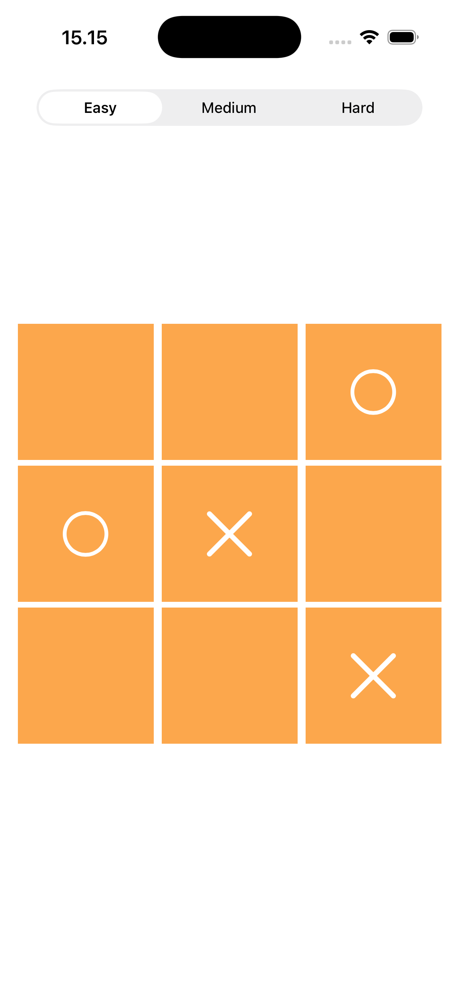

# Tic Tac Toe with AI - SwiftUI

iOS Tic Tac Toe game build with SwiftUI featuring a computer opponent with different difficulty levels.

## Features 
- Classic 3x3 Tic Tac Toe gameplay
- AI opponent with 3 difficulties:
  - Easy - random moves
  - Medium - blocks obvious wins
  - Hard - prioritizes winning, blocking, and optimal positioning

## Tech Stack
- Language: Swift
- UI Frameworks: SwiftUI
- State Management: Combine
- Platform: iOS

## How to Run
- Clone the repo on your selected folder
- Open the project in Xcode
- Select an iOS simulator/device
- Press Run

## Requirements
- Xcode 15+
- iOS 17+

## Screenshots

